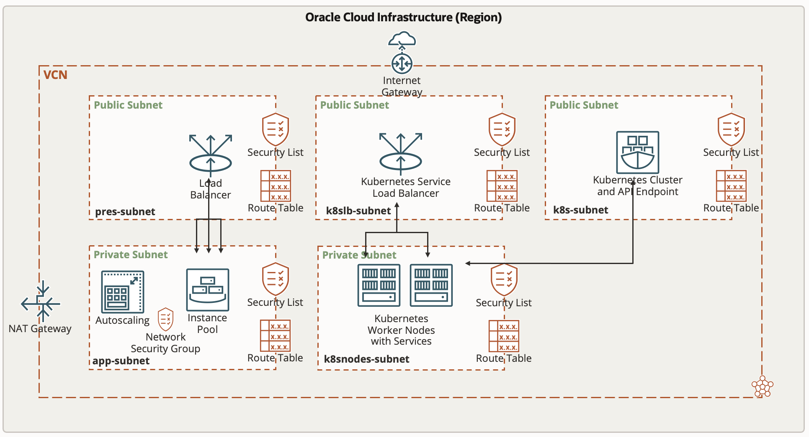

# Application Infrastructure


Oracle Cloud Infrastructure (OCI) allows different deployment models to be applied within a shared network and deployed by the same Infrastructure-as-Code methods. Setting up our operation, we distinguish core and orchestration service API. Core services represent the physical infrastructure in our data center, orchestration services refer to software that runs outside the core service portfolio, interacts with the application code and manipulates the behaviour of virtual instances. Application developers and service operators need to distinguish the following four infrastructure deplyment models designing a multi-server architecture:

* Dedicated Server - virtual machines (VM) or baremetal server that maintain stateful communication interfaces on layer three
* Elastic Compute cluster - one or more VM that scale automatically and maintain a stateless communication interface on layer three
* Container Cluster - one or more dedicated server that host lightweight stand-alone, executable user space images including code, runtime, system tools, system libraries, settings to run on a linux kernel
* Functions, ephemeral, single purpose, self contained, stateless container without API surface, invoked via network protocolls like HTTP

while public cloud providers offer these instance types as product, in OCI we define logical resources including the repective orchestrator. We can rely on managed services for open source orchstratore or choose commercial third-party offerings. We invoke an orchestrator, writing modules for the resource manager. Here we will focus on these three different models:


1. The **Host model** is the one most known from on-premise environments: On a dedicated physical machine, Virtual Machines (VMs) can be deployed that run stateless or stateful applications. OCI offers both ways here: 
    - You can deploy a bare metal host, install the hypervisor and deploy the VMs on top of it. Here, you are responsible for the VMs and the hypervisor layer as well as the Operating System (O/S) of the bare metal host. You will have full root access to the O/S of the bare metal server and it will be inside a Virtual Cloud Network (VCN) that you own.
    - You can deploy a Dedicated VM Host and deploy the VMs on top of it. This is the approach that we use here: You can use Terraform to fully deploy both the Dedicated VM Host as well as the VMs on top of it. Each VM will be instantiated which its own Virtual Network Interface Card (VNIC) which can be individually placed into VCNs and subnets that you own. The Dedicated VM Host itself will be in full control by Oracle, you won't have any O/S access to it and the Dedicated VM Host won't be placed in any VCN.
You can use tools like **Packer** to first build a custom image with all applications and data you need on your VMs before applying Terraform to instatiate the VMs. The ```cloud-init``` option of Terraform gives the opportunity to apply a shell script on the instantiated VMs to add indivdual data or installations immediately after the instantiation. Here, the shell script is added as a base64-encoded attribute to the resource definition of the instance. Through metadata key-value pairs, Terraform can pass parameters to the instance that can be used inside the cloud-init shell script to parameterize the actual shell execution.

The Terraform stack consists of a dedicatedHost.tf file which can be used to create a Dedicated VM Host. By default, this code is commented out because many demo-tenants do not allow the creation of Dedicated VM Hosts by its Service Limits. It can easliy being activated by removing the comments start/end lines.

2. The **Node model** applies the cloud principle to adapt the number of available nodes to the current amount of workload. Here we have primary workloads running that control secondary workloads on top which will be scaled in and out based on on-demand capacity rather than capacitiy from a Dedicated VM Host in order to optimize the costs. The secondary workloads should be stateless in nature since scaling in means that those nodes might be terminated by the Cloud Control at any time if the overall workload would be sufficiently executed by less nodes.
OCI has the following artifacts to create this scenario, which can be fully deployed by Terraform:
    - An Instance Configuration that acts as the blueprint for the pool of secondary workloads VMs. Here you define 
          - a Custom Image that should be used (can be build using **Packer** and you can use ```cloud-init``` provider for further work)
          - the Shape of the pool instances (e.g. *VM.Standard2.1* which means a 1 OCPU Intel X7 VM with network-attached storage)
          - the public part of the **ssh** key pair to access the O/S of the instance
    - The Instance Pool object refers to an Instance Configuration and adds information about in which Availability Domain as well as in which subnet the instance pool's instances' VNICs should be placed. Furthermore you define how many VMs should be started. You can add a load balancer to the instance pool definition in a way that any created instances inside the pool will be part of this load balancer's backend set, so that incoming requests are forwarded to the instance pool instances e.g. in a round-robin-manner. Load balancers also support cookie-badsed session stickyness in case this is needed by stateful applications running in the instance pool instances.
    - The Autoscaling Configuration refers to an Instance Pool and adds policies on when new instances should be automatically added and when instances should be removed. You define the incremental and decremental step size (numbers of instances to be added or removed when a scale-in or scale-out event occurs) as well as the minimum and maximum total number of instances. Two autoscaling policies are supported:
          - Schedule-based Autoscaling: Here the scaling-out and scaling-in rules are defined based on fixed schedules similar to definitions in cron jobs. This is feasible, if regular workload peaks are to be expected like loading data into a Data Warehouse or providing Analytic reporting at certain times during a day, week or month.
          - Metrics-based Autoscaling: Here the scaling-out and scaling-in rules are based on overall instance pool metrics that the instances report using agents to the Cloud Control. OCI allows the following metrics to be used here:
               - CPU Utilization (in percent)
               - Memory Utilization (in percent)
          - In the Autoscaling Configuration you define the percent threshold value above which the pool will scale out (add an instance or instances if the maximum number is not yet reached) and the percent threshold value underneath which the pool will scale in (terminate an instance or instances if the minimum number is not yet reached).

In the scenario, we trigger a 100% CPU utilization process in each new instance pool instance upon instance creation (using ```cloud-init```) that lasts for a number of minutes that the user can define as part of the Terraform stack definition as a variable. So we can optionally demonstrate the scaling-in and scaling-out according to an CPU-utilization based auto-scaling policy.

Further we deploy an httpd server along with a static page (showing a timestamp for the instance creation) on each instance pool instance. This stateless "application" is exposed to the public internet by a load balancer, so you can see the round-robin-fashioned forwarding of requests to the instance pool instances by reloading the page in the browser. The corresponding public load balancer endpoint is displayed a part of the Terraform out parameters. In this stack, the load balancer exposes the "application" with https, using a self-signed certificate that is also created inside the Terraform stack.

3. The **Container model** is the preferred cloud model for stateless applications like Functions. OCI offers a fully managed **Kubernetes** Cluster, the OCI Container Engine (OKE). Again, this can be fully deployed using Terraform. 
OKE consist of 
     - the Kubernetes Cluster which provides the Kubernetes API endpoint as well as the Scheduler and Controller Manager. These components are fully managed by Oracle and visible to the customer only using the Kubernetes API (e.g. by using **kubectl** or by deploying *Helm* charts). The customer doesn't have O/S access to this instance and also doesn't have to pay for it. This component is free of charge.
     - the Kubernetes Node Pool that contains the worker nodes. The customer has full root access using *ssh* and has to pay for these VMs. The charges are the regular charges for Linux VMs of the respective shapes -- there is no surcharge for their role being a Kubernetes worker node.
     - further elements are added and terminated according to Kubernetes deployments. E.g. when deploying a Load Balancer service to a Kubernetes cluster like

     
     ```
     kubectl expose deployment myapplication --type=LoadBalancer --name=myapplicationservice
     ```
     
     an OCI Load Balancer is automatically deployed and configured with the worker nodes in its backend set.

When the cluster is ready, the ```.kube/config``` file (which contains the network details like the Kubernetes Cluster's API endpoint's IP address and the authorization certificate) can be dowloaded to a client using the following OCI Command Line Interface (OCI CLI) command :

```
oci ce cluster create-kubeconfig --cluster-id ocid1.cluster.oc1.eu-frankfurt-1.aaaaathekubernetesclusterocidlqs27a --file $HOME/.kube/config --region eu-frankfurt-1 --token-version 2.0.0 
export KUBECONFIG=$HOME/.kube/config
```

The Terraform stack creates also an Kubernetes Cluster along with a worker node pool, the contents of the ```.kube/config```file can be directly taken by a corresponding parameter of the Terraform Output.

Then, the client can e.g apply **kubectl** to inspect, create and destroy Kubernetes artifacts:

```
$ kubectl get nodes,pods
NAME               STATUS   ROLES   AGE     VERSION
node/10.0.10.166   Ready    node    7h11m   v1.19.7

NAME                                 READY   STATUS    RESTARTS   AGE
pod/myapplication-588cf6ff66-cq684   1/1     Running   0          6h13m
pod/myapplication-588cf6ff66-hwtgd   1/1     Running   0          6h13m
pod/myapplication-588cf6ff66-q4228   1/1     Running   0          6h15m
```

OCI also offers a registry service (the OCI registry, OCIR) where container images can be stored and retrieved to be deployed to the Kubernetes cluster. OCIR allows registries both being publicly available (free access to anyone) or privately (downloading images prerequisites presenting a SWIFT-compliant API Key, a so called **OCI Auth Token** that is created individually for each OCI User).

Besides deploying Kubernetes artifacts like pods, deployments, services, replicasets etc. using a **kubectl** client, Terraform provides a Kubernetes provider in order to deploy these artifacts as part of the terraform apply process. The ```okeServiceDeployment.tf```shows the steps to take here:

1. Get the OKE Cluster's config file and extract the CA certificate as well as the OCI CLI command (along with the necessary arguments) to create an ExecCredential. This OCI CLI command is executed, so Terraform can authenticate to the Kubernetes API endpoint for further operations.
2. Create a new namespace in Kubernetes.
3. Define further resources like ```kubernetes_service```to deploy artifacts. Kubernetes artifacts are defined by yaml documents and those Terraform resources basically reformat these yaml documents to the HashiCorp Configuration Language (HCL) format.

In this example stack, we deploy a standard NGINX server to the new generated Kubernetes Cluster. We take the standard NGINX image from the official Docker registry, but you can also deploy your own pods from docker images that are stored e.g. in the OCI registry (OCIR).

We deploy this NGINX server as a ```kubernetes_service```with "Load Balancer" as the type using Terraform. The advantage of using Terraform instead of a local **kubectl** client for deploying Kubernetes services is, that those services are also being deleted when destroying the Terraform stack. This is important because deploying a Kubernetes service with "Load Balancer" as type means that an OCI Load Balancer with the Kubernetes deployment of pods in its backend is created outside of the Kubernetes Cluster. So you need to delete the Kubernetes service first when destroying the Terraform stack in order to properly remove this load balancer.

The complete network topology along with the compute instances, load balancers and Kubernetes resources that will be created by running this stack can be seen in this picture below:



After the Terraform stack has beeen successfully applied, the following Kubernetes artifacts can been (e.g. by using the cloud shell):

```
$ kubectl get pods,deployments,replicasets,services --namespace nginx
NAME                         READY   STATUS    RESTARTS   AGE
pod/nginx-5c48f8956d-84456   1/1     Running   0          41m
pod/nginx-5c48f8956d-wwq8s   1/1     Running   0          41m

NAME                    READY   UP-TO-DATE   AVAILABLE   AGE
deployment.apps/nginx   2/2     2            2           41m

NAME                               DESIRED   CURRENT   READY   AGE
replicaset.apps/nginx-5c48f8956d   2         2         2       41m

NAME            TYPE           CLUSTER-IP      EXTERNAL-IP      PORT(S)        AGE
service/nginx   LoadBalancer   10.96.113.223   152.70.173.212   80:32177/TCP   33m
```

[< db-infra][db-infra] | [+][home] | [workload >][workload] 

<!--- Links -->
[home]:       /README.md
[intro]:      /edu/step1-intro_provider/README.md
[provider]:   /edu/step1-intro_provider/provider.md
[base]:       /edu/step2-base/README.md
[db-infra]:   /edu/step3-dbinfra/README.md
[app-infra]:  /edu/step4-appinfra/README.md
[workload]:   /edu/step5-workload/README.md
[governance]: /edu/step6-governance/README.md
[vizualize]:  /edu/step7-vizualize/README.md


[code_hello]:       code/tenancy/hello.tf
[code_tenancy]:     code/tenancy/main.tf
[code_provider]:    code/tenancy/provider.tf
[code_tenancy]:     code/tenancy/tenancy.tf
[code_user]:        code/iam/user.tf
[code_compartment]: code/iam/compartment.tf

[oci_certification]: https://www.oracle.com/cloud/iaas/training/architect-associate.html
[oci_cli]:           https://docs.oracle.com/en-us/iaas/tools/oci-cli/latest/oci_cli_docs/
[oci_cloud]:         https://www.oracle.com/cloud/
[oci_cloudshell]:    https://docs.cloud.oracle.com/en-us/iaas/Content/API/Concepts/cloudshellintro.htm
[oci_data]:          https://registry.terraform.io/providers/hashicorp/oci/latest/docs
[oci_sdk]:           https://docs.cloud.oracle.com/en-us/iaas/Content/API/SDKDocs/terraform.htm
[oci_freetier]:      http://signup.oraclecloud.com/
[oci_global]:        https://www.oracle.com/cloud/architecture-and-regions.html
[oci_learn]:         https://learn.oracle.com/ols/user-portal
[oci_learning]:      https://learn.oracle.com/ols/learning-path/become-oci-architect-associate/35644/75658
[oci_homeregion]:    https://docs.cloud.oracle.com/en-us/iaas/Content/Identity/Tasks/managingregions.htm
[oci_identifier]:    https://docs.cloud.oracle.com/en-us/iaas/Content/General/Concepts/regions.htm
[oci_identity]:      https://registry.terraform.io/providers/hashicorp/oci/latest/docs/data-sources/identity_availability_domains
[oci_ilom]:          https://www.oracle.com/servers/technologies/integrated-lights-out-manager.html
[oci_offbox]:        https://blogs.oracle.com/cloud-infrastructure/first-principles-l2-network-virtualization-for-lift-and-shift
[oci_provider]:      https://github.com/terraform-providers/terraform-provider-oci
[oci_region]:        https://registry.terraform.io/providers/hashicorp/oci/latest/docs/data-sources/identity_regions
[oci_regions]:       https://www.oracle.com/cloud/data-regions.html
[oci_regionmap]:     https://www.oracle.com/cloud/architecture-and-regions.html
[oci_sdk]:           https://docs.cloud.oracle.com/en-us/iaas/Content/API/SDKDocs/terraform.htm
[oci_tenancy]:       https://docs.oracle.com/en-us/iaas/Content/GSG/Concepts/settinguptenancy.htm
[oci_training]:      https://www.oracle.com/cloud/iaas/training/


[tf_doc]: https://registry.terraform.io/providers/hashicorp/oci/latest/docs
[cli_doc]: https://docs.cloud.oracle.com/en-us/iaas/tools/oci-cli/latest/oci_cli_docs/
[iam_doc]: https://docs.cloud.oracle.com/en-us/iaas/Content/Identity/Concepts/overview.htm
[network_doc]: https://docs.cloud.oracle.com/en-us/iaas/Content/Network/Concepts/overview.htm
[compute_doc]: https://docs.cloud.oracle.com/en-us/iaas/Content/Compute/Concepts/computeoverview.htm#Overview_of_the_Compute_Service
[storage_doc]: https://docs.cloud.oracle.com/en-us/iaas/Content/Object/Concepts/objectstorageoverview.htm
[database_doc]: https://docs.cloud.oracle.com/en-us/iaas/Content/Database/Concepts/databaseoverview.htm

[iam_video]: https://www.youtube.com/playlist?list=PLKCk3OyNwIzuuA-wq2rVuxUE13rPTvzQZ
[network_video]: https://www.youtube.com/playlist?list=PLKCk3OyNwIzvHm2E-cGrmoMes-VwanT3P
[compute_video]: https://www.youtube.com/playlist?list=PLKCk3OyNwIzsAjIaUaVsKdXcfBOy6LASv
[storage_video]: https://www.youtube.com/playlist?list=PLKCk3OyNwIzu7zNtt_w1dXFOUbAjheMeo
[database_video]: https://www.youtube.com/watch?v=F4-sxIsnbKI&list=PLKCk3OyNwIzsfuB9kj1CTPavjgByJBXGK

[jmespath_site]: https://jmespath.org/tutorial.html
[jq_site]: https://stedolan.github.io/jq/
[jq_play]: https://jqplay.org/
[json_validate]: https://jsonlint.com/

[vsc_site]: https://code.visualstudio.com/

[terraform]: https://www.terraform.io/
[tf_examples]: https://github.com/terraform-providers/terraform-provider-oci/tree/master/examples
[tf_lint]: https://www.hashicorp.com/blog/announcing-the-terraform-visual-studio-code-extension-v2-0-0

[oci_regions]: https://www.oracle.com/cloud/data-regions.html
